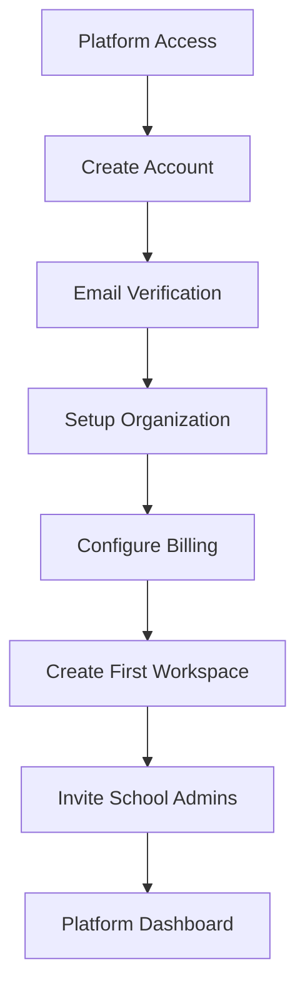
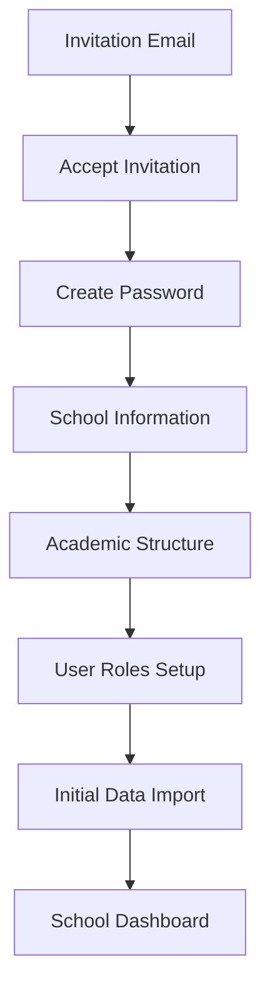
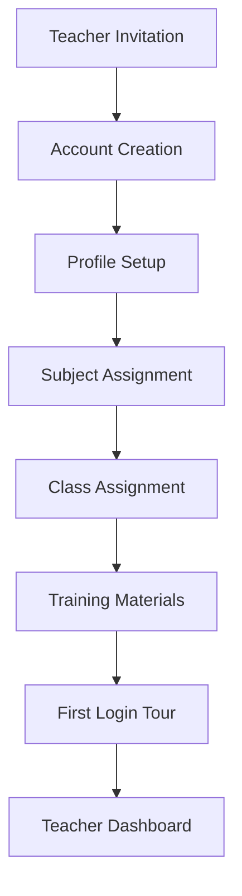
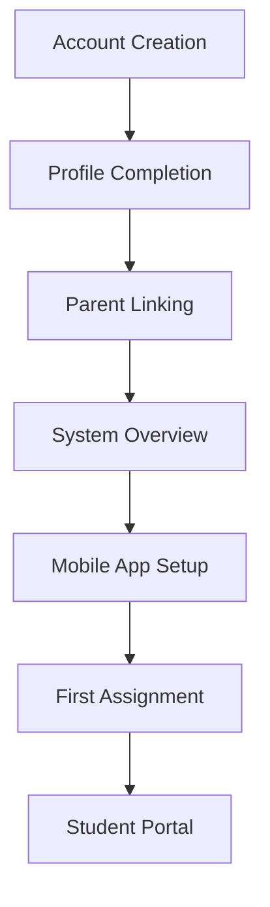

# Onboarding Flows

## User Onboarding Journey

### 1. Super Admin Onboarding (Platform Setup)



#### Step-by-Step Process:

**Step 1: Account Creation**
- Email registration with strong password
- Email verification with secure token
- Initial profile setup (name, phone, role)

**Step 2: Organization Setup**
- Organization name and details
- Billing information setup
- Subscription plan selection
- Payment method configuration

**Step 3: Platform Configuration**
- Global system settings
- Default role permissions
- Email templates setup
- Integration configurations

### 2. School Admin Onboarding (School Setup)



#### Step-by-Step Process:

**Step 1: School Basic Information**
```
┌─────────────────────────────────────────────┐
│ School Setup - Step 1 of 6                 │
│                                             │
│ School Information                          │
│ ┌─────────────────────────────────────────┐ │
│ │ School Name: [_________________]        │ │
│ │ School Code: [_________________]        │ │
│ │ Registration Number: [_________]        │ │
│ │ Established Year: [____]                │ │
│ │                                         │ │
│ │ Address: [__________________________]   │ │
│ │ City: [____________] State: [_______]   │ │
│ │ PIN Code: [______] Country: [_______]   │ │
│ │                                         │ │
│ │ Phone: [_______________]                │ │
│ │ Email: [_______________]                │ │
│ │ Website: [_____________]                │ │
│ │                                         │ │
│ │ [Upload Logo] [Upload Banner]           │ │
│ │                                         │ │
│ │        [Skip]           [Next]          │ │
│ └─────────────────────────────────────────┘ │
└─────────────────────────────────────────────┘
```

**Step 2: Academic Structure Setup**
```
┌─────────────────────────────────────────────┐
│ School Setup - Step 2 of 6                 │
│                                             │
│ Academic Year & Classes                     │
│ ┌─────────────────────────────────────────┐ │
│ │ Current Academic Year                   │ │
│ │ Name: [2024-2025]                       │ │
│ │ Start Date: [01/04/2024]                │ │
│ │ End Date: [31/03/2025]                  │ │
│ │                                         │ │
│ │ Classes & Sections                      │ │
│ │ ┌─────────────────────────────────────┐ │ │
│ │ │Class│Sections      │Capacity│ Action│ │ │
│ │ ├─────────────────────────────────────┤ │ │
│ │ │ 1   │A, B, C       │ 30     │ [Edit]│ │ │
│ │ │ 2   │A, B          │ 30     │ [Edit]│ │ │
│ │ │ ... │              │        │       │ │ │
│ │ │ 12  │A, B, C, D    │ 40     │ [Edit]│ │ │
│ │ └─────────────────────────────────────┘ │ │
│ │                                         │ │
│ │ [Add Class] [Import from Template]      │ │
│ │                                         │ │
│ │        [Previous]       [Next]          │ │
│ └─────────────────────────────────────────┘ │
└─────────────────────────────────────────────┘
```

**Step 3: Subject Management**
```
┌─────────────────────────────────────────────┐
│ School Setup - Step 3 of 6                 │
│                                             │
│ Subjects & Curriculum                       │
│ ┌─────────────────────────────────────────┐ │
│ │ Core Subjects                           │ │
│ │ ☑ Mathematics    ☑ English Literature   │ │
│ │ ☑ Science        ☑ Social Studies      │ │
│ │ ☑ Hindi          ☑ Computer Science     │ │
│ │                                         │ │
│ │ Optional Subjects                       │ │
│ │ ☐ French         ☐ German              │ │
│ │ ☐ Music          ☐ Art                 │ │
│ │ ☐ Physical Ed.   ☐ Dance               │ │
│ │                                         │ │
│ │ Subject-Class Mapping                   │ │
│ │ [Auto-assign to all classes]            │ │
│ │ [Custom assignment per class]           │ │
│ │                                         │ │
│ │ [Add Custom Subject]                    │ │
│ │                                         │ │
│ │        [Previous]       [Next]          │ │
│ └─────────────────────────────────────────┘ │
└─────────────────────────────────────────────┘
```

**Step 4: User Roles & Permissions**
```
┌─────────────────────────────────────────────┐
│ School Setup - Step 4 of 6                 │
│                                             │
│ User Roles & Permissions                    │
│ ┌─────────────────────────────────────────┐ │
│ │ Role Configuration                      │ │
│ │                                         │ │
│ │ Principal (1)                           │ │
│ │ ☑ All permissions                       │ │
│ │                                         │ │
│ │ Teachers (estimated: 15-20)             │ │
│ │ ☑ Student management                    │ │
│ │ ☑ Attendance                           │ │
│ │ ☑ Grades & Reports                     │ │
│ │ ☐ Financial data                       │ │
│ │                                         │ │
│ │ Students (estimated: 300-500)           │ │
│ │ ☑ View own records                     │ │
│ │ ☑ Access timetable                     │ │
│ │ ☐ Modify data                          │ │
│ │                                         │ │
│ │ Parents (estimated: 300-500)            │ │
│ │ ☑ View child's records                 │ │
│ │ ☑ Fee payments                         │ │
│ │ ☑ Communication                        │ │
│ │                                         │ │
│ │ [Customize Permissions]                 │ │
│ │                                         │ │
│ │        [Previous]       [Next]          │ │
│ └─────────────────────────────────────────┘ │
└─────────────────────────────────────────────┘
```

**Step 5: Fee Structure Setup**
```
┌─────────────────────────────────────────────┐
│ School Setup - Step 5 of 6                 │
│                                             │
│ Fee Structure                               │
│ ┌─────────────────────────────────────────┐ │
│ │ Fee Categories                          │ │
│ │                                         │ │
│ │ Tuition Fee (Annual)                    │ │
│ │ Class 1-5: [$5,000]  Class 6-8: [$6,000]│ │
│ │ Class 9-10: [$8,000] Class 11-12: [$10,000]│ │
│ │                                         │ │
│ │ Additional Fees                         │ │
│ │ Admission Fee: [$500] (One-time)        │ │
│ │ Library Fee: [$200] (Annual)            │ │
│ │ Lab Fee: [$300] (Annual)                │ │
│ │ Transport Fee: [$1,200] (Annual)        │ │
│ │ Exam Fee: [$100] (Per exam)             │ │
│ │                                         │ │
│ │ Payment Options                         │ │
│ │ ☑ Annual payment (5% discount)          │ │
│ │ ☑ Semester payment                      │ │
│ │ ☑ Quarterly payment                     │ │
│ │ ☑ Monthly payment                       │ │
│ │                                         │ │
│ │ [Add Fee Category]                      │ │
│ │                                         │ │
│ │        [Previous]       [Next]          │ │
│ └─────────────────────────────────────────┘ │
└─────────────────────────────────────────────┘
```

**Step 6: Data Import & Integration**
```
┌─────────────────────────────────────────────┐
│ School Setup - Step 6 of 6                 │
│                                             │
│ Data Import & Setup Completion              │
│ ┌─────────────────────────────────────────┐ │
│ │ Import Existing Data                    │ │
│ │                                         │ │
│ │ Student Records                         │ │
│ │ [Upload CSV] [Download Template]        │ │
│ │                                         │ │
│ │ Teacher Records                         │ │
│ │ [Upload CSV] [Download Template]        │ │
│ │                                         │ │
│ │ Parent Records                          │ │
│ │ [Upload CSV] [Download Template]        │ │
│ │                                         │ │
│ │ Integrations (Optional)                 │ │
│ │ ☐ Google Workspace                      │ │
│ │ ☐ Microsoft 365                        │ │
│ │ ☐ SMS Gateway                          │ │
│ │ ☐ Email Service                        │ │
│ │                                         │ │
│ │ Setup Summary                           │ │
│ │ ✓ School information complete           │ │
│ │ ✓ Academic structure ready              │ │
│ │ ✓ Subjects configured                   │ │
│ │ ✓ Roles & permissions set               │ │
│ │ ✓ Fee structure defined                 │ │
│ │                                         │ │
│ │        [Previous]    [Complete Setup]   │ │
│ └─────────────────────────────────────────┘ │
└─────────────────────────────────────────────┘
```

### 3. Teacher Onboarding



#### Teacher Welcome Process:

**Step 1: Welcome & Profile**
```
┌─────────────────────────────────────────────┐
│ Welcome to Springfield High School!        │
│                                             │
│ Complete Your Teacher Profile              │
│ ┌─────────────────────────────────────────┐ │
│ │ Personal Information                    │ │
│ │ Name: [John Doe] (from invitation)     │ │
│ │ Employee ID: [T001]                     │ │
│ │ Phone: [_______________]                │ │
│ │ Emergency Contact: [_______________]     │ │
│ │                                         │ │
│ │ Professional Information                │ │
│ │ Qualification: [_______________]         │ │
│ │ Experience: [__ years]                  │ │
│ │ Specialization: [_______________]        │ │
│ │ Previous School: [_______________]       │ │
│ │                                         │ │
│ │ [Upload Photo] [Upload Documents]       │ │
│ │                                         │ │
│ │               [Save & Continue]         │ │
│ └─────────────────────────────────────────┘ │
└─────────────────────────────────────────────┘
```

**Step 2: System Overview Tour**
```
┌─────────────────────────────────────────────┐
│ 🎯 Quick Tour - Teacher Features           │
│                                             │
│ ┌─────────────────────────────────────────┐ │
│ │ 👋 Welcome! Let's show you around...    │ │
│ │                                         │ │
│ │ Your main responsibilities:             │ │
│ │ • Manage student attendance             │ │
│ │ • Record grades and assessments         │ │
│ │ │ • View your timetable                 │ │
│ │ • Communicate with parents              │ │
│ │ • Access teaching resources             │ │
│ │                                         │ │
│ │ [📱 Get Mobile App] [📖 View Guide]     │ │
│ │                                         │ │
│ │     [Skip Tour]     [Start Tour]        │ │
│ └─────────────────────────────────────────┘ │
└─────────────────────────────────────────────┘
```

### 4. Student/Parent Onboarding



#### Student Welcome Process:

**Step 1: Account Activation**
```
┌─────────────────────────────────────────────┐
│ Welcome to Springfield High School Portal! │
│                                             │
│ Activate Your Student Account              │
│ ┌─────────────────────────────────────────┐ │
│ │ Student Information                     │ │
│ │ Name: Sarah Johnson                     │ │
│ │ Roll Number: 001                        │ │
│ │ Class: 10-A                             │ │
│ │ Admission Number: ADM2024001            │ │
│ │                                         │ │
│ │ Set Your Password                       │ │
│ │ Password: [_______________]              │ │
│ │ Confirm: [_______________]               │ │
│ │                                         │ │
│ │ Security Question                       │ │
│ │ What is your pet's name? [_______]      │ │
│ │                                         │ │
│ │ Parent Email (for linking):             │ │
│ │ [parent@email.com]                      │ │
│ │                                         │ │
│ │            [Activate Account]           │ │
│ └─────────────────────────────────────────┘ │
└─────────────────────────────────────────────┘
```

**Step 2: Student Dashboard Tour**
```
┌─────────────────────────────────────────────┐
│ 📚 Your Student Portal                     │
│                                             │
│ ┌─────────────────────────────────────────┐ │
│ │ Here's what you can do:                 │ │
│ │                                         │ │
│ │ 📅 Check your timetable                 │ │
│ │ 📊 View your grades and reports         │ │
│ │ 📖 Access assignments and homework      │ │
│ │ 🚌 Check transport schedule             │ │
│ │ 📚 Browse library catalog              │ │
│ │ 💬 Communicate with teachers            │ │
│ │ 💰 View fee payment status              │ │
│ │                                         │ │
│ │ [📱 Download Mobile App]                │ │
│ │                                         │ │
│ │     [Skip]        [Take Tour]           │ │
│ └─────────────────────────────────────────┘ │
└─────────────────────────────────────────────┘
```

### 5. Parent Onboarding

**Step 1: Parent Account Setup**
```
┌─────────────────────────────────────────────┐
│ Parent Portal Registration                  │
│                                             │
│ ┌─────────────────────────────────────────┐ │
│ │ Link to Your Child's Account            │ │
│ │                                         │ │
│ │ Child's Information                     │ │
│ │ Student Name: [_______________]          │ │
│ │ Roll Number: [_______________]           │ │
│ │ Class: [_______________]                 │ │
│ │ Admission Number: [_______________]      │ │
│ │                                         │ │
│ │ Parent Information                      │ │
│ │ Father's Name: [_______________]         │ │
│ │ Mother's Name: [_______________]         │ │
│ │ Primary Contact: [_______________]       │ │
│ │ Email: [_______________]                 │ │
│ │ Occupation: [_______________]            │ │
│ │                                         │ │
│ │ Relationship: [Father ▼]                │ │
│ │                                         │ │
│ │            [Create Account]             │ │
│ └─────────────────────────────────────────┘ │
└─────────────────────────────────────────────┘
```

## Onboarding Success Metrics

### Key Performance Indicators (KPIs)

1. **Completion Rates**
   - School setup completion: Target 95%
   - Teacher onboarding completion: Target 90%
   - Student/Parent activation: Target 85%

2. **Time to Value**
   - School operational in < 2 days
   - Teachers productive in < 1 day
   - Students/Parents active in < 2 hours

3. **User Engagement**
   - Daily active users within first week
   - Feature adoption rates
   - Support ticket volume

### Progressive Disclosure Strategy

1. **Core Features First**
   - Essential functionality upfront
   - Advanced features introduced gradually
   - Contextual help and tooltips

2. **Role-Based Onboarding**
   - Customized flows per user type
   - Relevant features highlighted
   - Permission-based access

3. **Continuous Learning**
   - Weekly tips and tricks
   - Feature spotlight emails
   - Interactive tutorials

### Onboarding Analytics Dashboard

```
┌─────────────────────────────────────────────┐
│ Onboarding Analytics                        │
│                                             │
│ ┌─────────────────────────────────────────┐ │
│ │ This Month                              │ │
│ │ Schools Onboarded: 12                   │ │
│ │ Users Activated: 2,450                  │ │
│ │ Completion Rate: 87%                    │ │
│ │ Avg. Setup Time: 3.2 hours             │ │
│ └─────────────────────────────────────────┘ │
│                                             │
│ ┌─────────────────────────────────────────┐ │
│ │ Conversion Funnel                       │ │
│ │ Invitation Sent: 100%                   │ │
│ │ Account Created: 78%                    │ │
│ │ Profile Completed: 65%                  │ │
│ │ First Login: 58%                        │ │
│ │ Active User (7 days): 45%               │ │
│ └─────────────────────────────────────────┘ │
│                                             │
│ ┌─────────────────────────────────────────┐ │
│ │ Drop-off Points                         │ │
│ │ 1. Password creation (22%)              │ │
│ │ 2. Profile completion (13%)             │ │
│ │ │ 3. Data import (7%)                   │ │
│ │ 4. First feature use (13%)              │ │
│ └─────────────────────────────────────────┘ │
└─────────────────────────────────────────────┘
```

## Best Practices for Onboarding

### 1. Minimize Cognitive Load
- Single task per step
- Clear progress indicators
- Smart defaults where possible
- Option to skip non-essential steps

### 2. Provide Value Immediately
- Show sample data during setup
- Quick wins in first session
- Immediate access to core features
- Success celebration moments

### 3. Offer Multiple Learning Paths
- Quick setup for experts
- Guided tour for beginners
- Video tutorials for visual learners
- Documentation for reference

### 4. Ensure Mobile Experience
- Mobile-responsive onboarding
- Touch-friendly interactions
- Simplified mobile flows
- App store integration

### 5. Continuous Improvement
- A/B testing onboarding flows
- User feedback collection
- Analytics-driven optimization
- Regular content updates